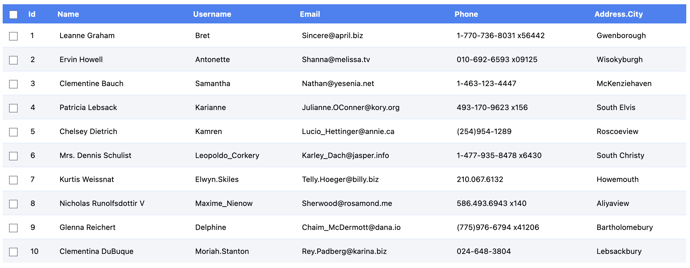
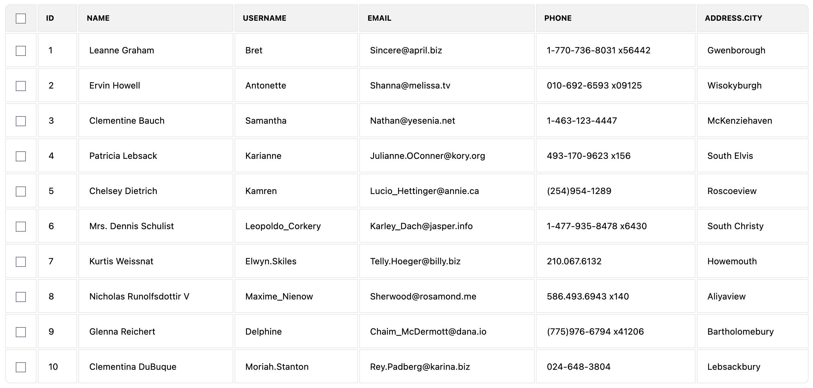
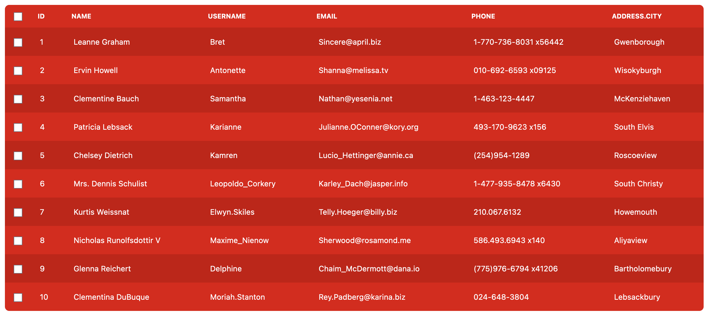

# Custom Styles

While `VTable` provides its own default styles, you have complete freedom to override them or define your own from scratch.

To use your custom styles, **simply don't import `vtbl/style.css`**.

```ts
// Don't do this!
import 'vtbl/style.css'; // [!code error]
```

## Examples

Here are a few examples of custom tables, styled with `tailwindcss`:

### Blue



```css
.v-table {
    @apply text-sm;
}

.v-table th {
    @apply p-2 bg-blue-500 text-white capitalize;
}

.v-table tr {
    @apply border-t border-blue-100 first-of-type:border-none;
}

.v-table tr:nth-child(even) {
    @apply bg-blue-900/5;
}

.v-table td {
    @apply p-3;
}
```

### Bordered



```css
.v-table {
    @apply text-sm border-separate;
}

.v-table th {
    @apply p-3 border bg-black/5 uppercase text-xs first-of-type:rounded-tl-lg last-of-type:rounded-tr-lg;
}

.v-table tr:last-of-type td {
    @apply first-of-type:rounded-bl-lg last-of-type:rounded-br-lg;
}

.v-table td {
    @apply p-4 border;
}
```

### Red



```css
.v-table {
    @apply text-sm bg-[#f00] text-white rounded-lg;
}

.v-table th {
    @apply p-3 bg-black/10 uppercase text-xs first-of-type:rounded-tl-lg last-of-type:rounded-tr-lg;
}

.v-table tr:last-of-type td {
    @apply first-of-type:rounded-bl-lg last-of-type:rounded-br-lg;
}

.v-table tr:nth-child(even) td {
    @apply bg-black/10;
}

.v-table td {
    @apply p-4 bg-black/20;
}
```

These examples just scratch the surface of what's possible with custom styles. Feel free to modify these examples or create your own unique styles from scratch.
