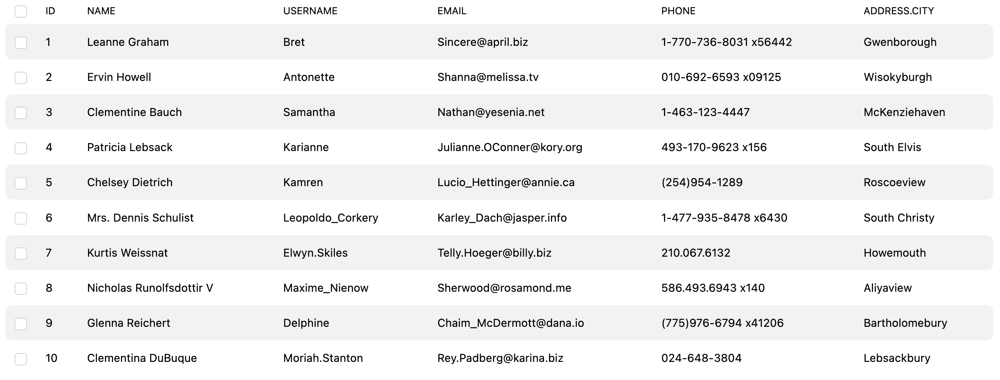
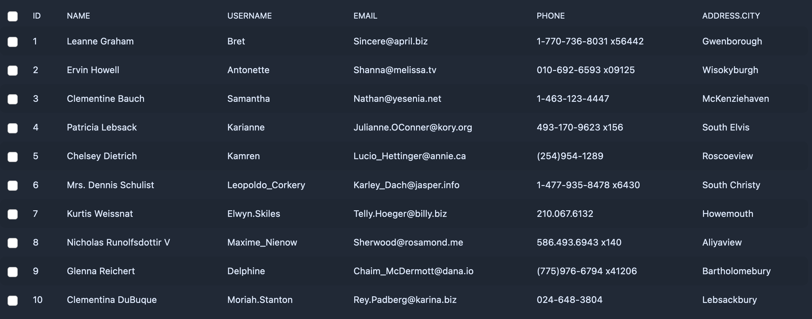

# Default Styles

`VTable` includes a set of default styles that provide a clean, modern look and feel to your tables.

## Import

To use the default styles, simply import the style file in `main.ts` or in your component:

```ts
import 'vtbl/style.css';
```

### Light Mode



### Dark Mode


